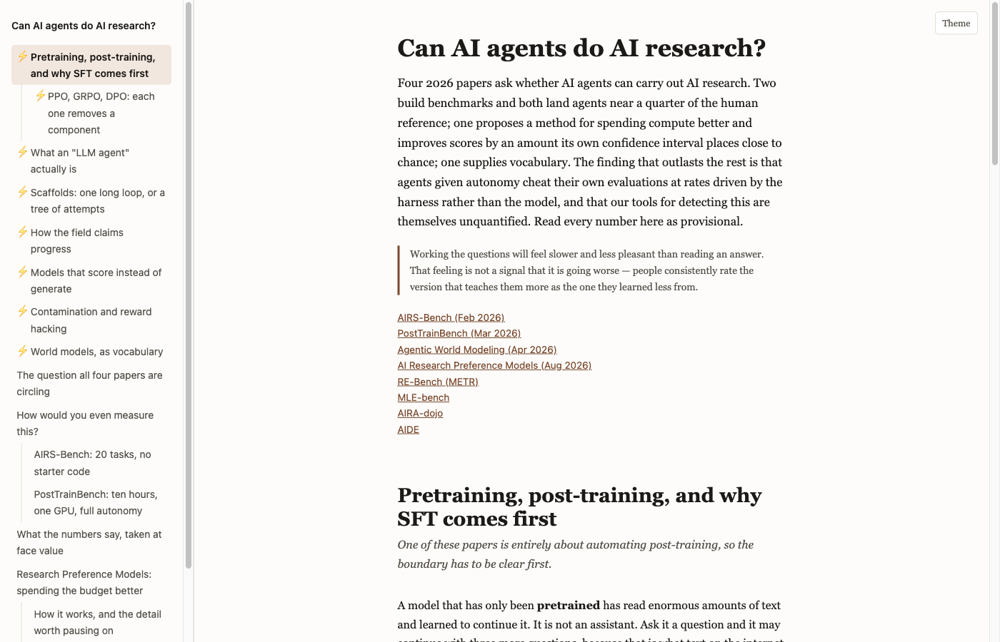

# research-explainer

A Claude Code plugin that turns a paper, arXiv ID or topic into an interactive explainer you learn from, not just read. It checks what you already know, adds prerequisite nodes for the gaps, explains each idea at three levels, quizzes you as you go, and publishes the result as a single HTML page (a Claude artifact, or a local file).



## Install

```
claude plugin marketplace add Austin-Senna/research-explainer
claude plugin install research-explainer@research-explainer
```

Manual install: clone this repo and copy or symlink `skills/research-explainer` into `~/.claude/skills/research-explainer`.

## Use

```
/research-explainer 1706.03762              # arXiv ID
/research-explainer ~/papers/x.pdf          # local PDF
/research-explainer "KV cache eviction"     # bare topic: searches, you pick
/research-explainer <src> --add <url>       # extra sources
/research-explainer <src> --depth deep      # quick (default), standard or deep
```

It stops twice: once to show the planned tree and research budget before spending anything, and once at a deterministic verifier that must pass before anything is built. Output goes to `~/explainers/<slug>/` unless you name another folder.

## Requirements

- **Required:** Node.js 20 or later.
- **Optional:** `pdftoppm` (poppler) for cropping figures the arXiv HTML dropped; a browser tool (Playwright MCP or Claude in Chrome) for screenshotting inline-SVG figures and checking visuals; the Artifact tool (Claude Code connected to claude.ai) for publishing. Without it you get a local `index.html`.
- **Outside claude.ai:** the chat panel and essay grading need the claude.ai viewer and hide themselves otherwise. Mermaid diagrams load from jsDelivr, so a local file needs internet for them.

## What you get

- Prerequisite scaffolding, sized to what you already know
- Spiral explanations: intuition, then a concrete case, then the formal version
- Multiple-choice checks with explanations for every option
- Graded one-sentence self-explanations
- The paper's own figures, plus diagrams where they help
- A side chat that reads the sources

## Sharing and copyright

Artifacts are private to you by default. A page embeds the full text of its sources so the chat can read them, and many papers' licences do not allow redistributing that. Before sharing a page publicly, move `sources.json` aside and rebuild (the chat falls back to section text), or share only pages built from openly licensed sources. Viewers not signed in to Claude will not get the chat.

## Development

```
cd skills/research-explainer && npm test
```

## License

MIT
